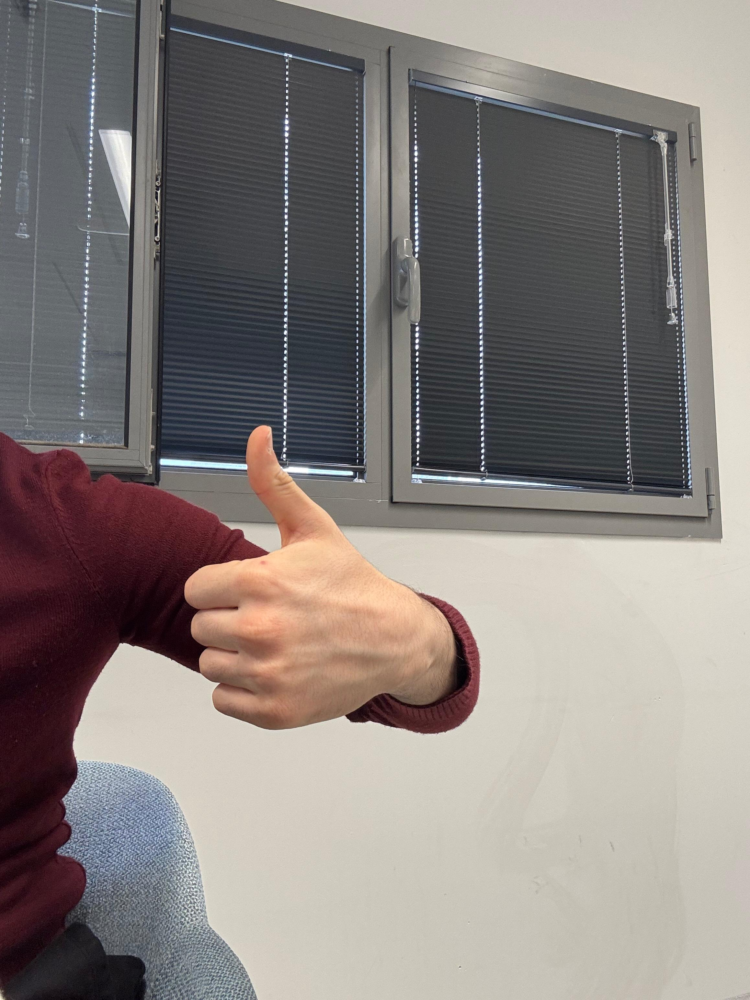
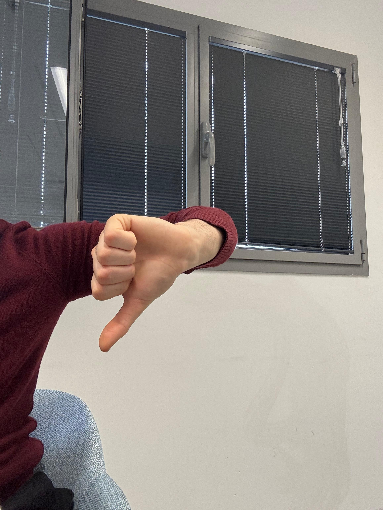
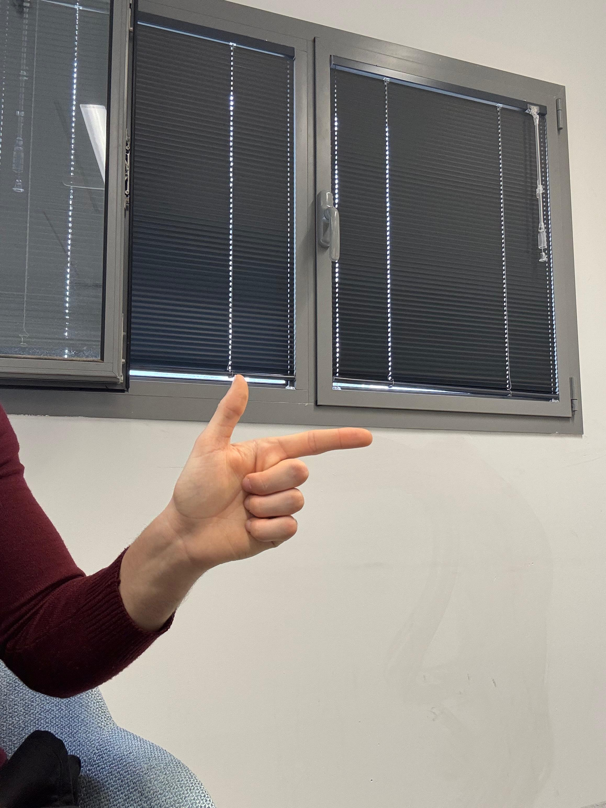
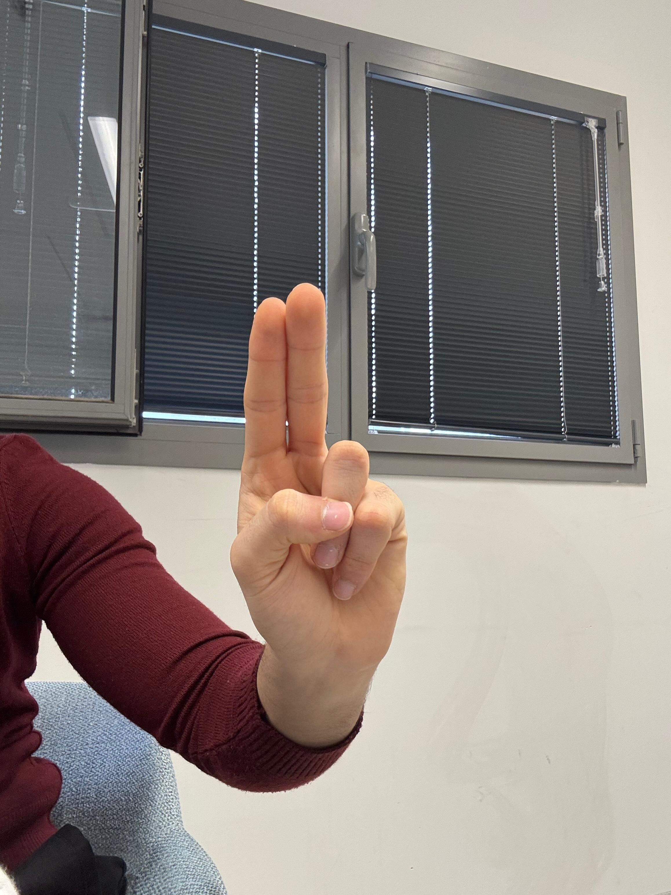
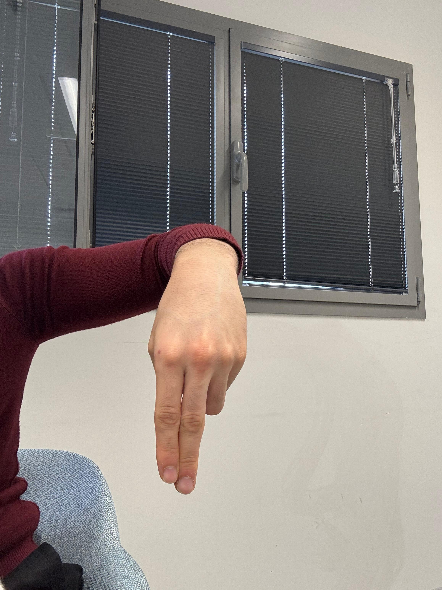
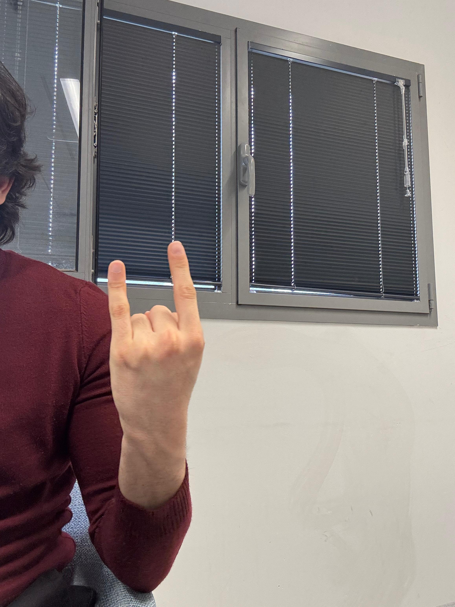
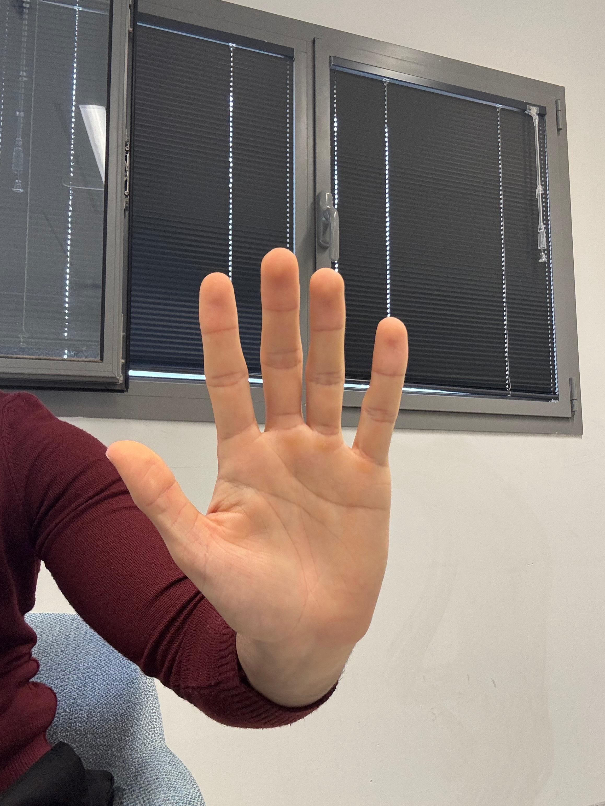
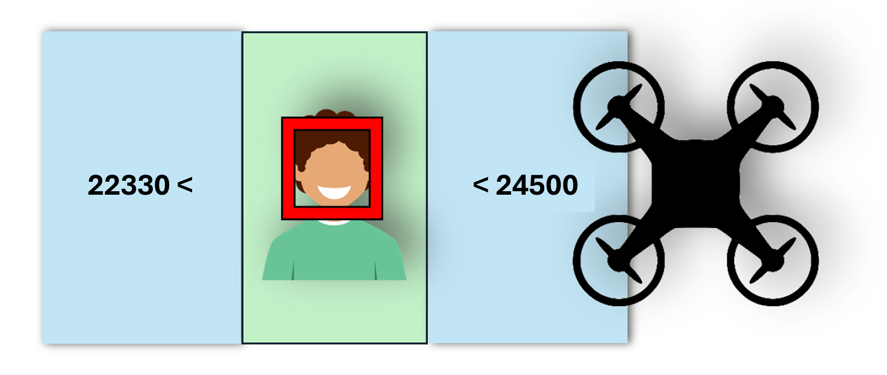

# Drone Hand Gesture Control &amp; Face tracking

## Overview:
Traditional methods of drone control, such as remote controllers and mobile
applications, require substantial manual input and expertise, limiting their
accessibility and usability for the usual individual. Not only that, but in some cases
carrying a remote controller on-set can be troublesome, for example filming while
standing in a pool of water, or when the remote controller is broken etc.
To solve that, we will design **Hand Gesture Control &amp; Face tracking control-based
modes to make drone controlling more user-friendly and intuitive.**   
Currently (almost) every individual has experienced using technology that takes touch as an input like a
keyboard or a smartphone, which means that basing such a complicated task of
drone controlling on hand gestures will be significantly easier to do in our age
compared to the previous years.

## Set up:
1. Clone the repo:  
    `git clone https://github.com/jinMori127/Hand-Drone-Control.git`
2. Install the required packages:  
   `pip install -r requirement.txt`  

**Note:** Our code works on tello drone, to run the code you need to have a drone that is compatible with the  
`djitellopy` library, otherwise you will need to change the commands that flight commands.

## How to run & use:

- Turn on the drone and make sure its connected to the computer.
- Place the drone in an open area with minimal to no obstacles and a high ceiling.
- Run the tello.py file: `python tello.py`.
  - Wait for the drone to ascend.
  - The drone will be ready to receive commands once you see the camera window on your computer.
- Now you can control the drone using 3 modes:

### First mode: Hand gesture control
In this mode the drone will detect hand signs and follow the corresponding command, The commands are:

#### Gesture guide

  <table>
    <tr>
      <td align="center">
         
        <b>Up</b>
      </td>
      <td align="center">
         
        <b>Down</b>
      </td>
      <td align="center">
         
        <b>Left</b>
      </td>
      <td align="center">
         
        <b>Right</b>
      </td>
    </tr>
    <tr>
      <td align="center">
         
        <b>Forward</b>
      </td>
      <td align="center">
         
        <b>Backward</b>
      </td>
      <td align="center">
         
        <b>Mode</b>
      </td>
      <td align="center">
         
        <b>Stop</b>
      </td>
    </tr>
  </table>

The drone supports both left and right hand control, only one hand is detected at a time.
### Second mode: Face following
In this mode the drone will follow your face and move accordingly, the face will always be in the middle of the frame.
- insert demo

The drone detects the closest face and follows it.

### Third mode: Hand gesture control & Face following
In this mode we combine the two previous modes into one, now the **Face Following** mode just will control the yaw to keep the face in the center.  
The drone will detect hand gestures and perform the corresponding commands.
- insert demo.

## Strategy and algorithms used:
- **Hand landmark:** we used the pretrained network of MidiaPipe which give a very good results for doing that.
- **Hand gesture recognition:** For that we took the landmark and apply some checks on it, since we have a lot of frames 
we used the debouncing mechanism to enhance the stability of the recognition.  
    - debouncing mechanism: for each label will be a `threshold` and when `debounce[gesture] >= threshold` we will take it as a recognized gesture and set it back to 0.  
      for each other label that not recognized at the current frame we will subtract one from it's `debounce[other_gesture]`.
-  **Face tracking:** Track the faces using cv2 library `cv2.CascadeClassifier` which is  considered a good classifier for out task 
as it has a 90% accuracy for frontal face detection, also we will always follow the closest face to the camera since we can detect multiple faces.  

  

To keep the face in the center we used **PID** which will help us to decide how much we should move each time.
